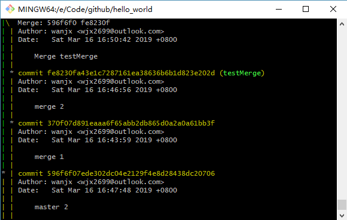
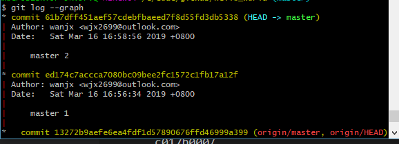

> Algorithm、Review、Tip、Share 简称ARTS  
>1) 每周至少做一个 leetcode 的算法题  
>2) 阅读并点评至少一篇英文技术文章
>3) 学习至少一个技术技巧  
>4) 分享一篇有观点和思考的技术文章
## Algorithm  
### 方法一  
两个有序数组，考虑用插入排序的方法从索引n1开始将两个数组排序，然后返回中值。  
```
`Java`
class Solution {
    public double findMedianSortedArrays(int[] nums1, int[] nums2) {
        int n1 = nums1.length, n2 = nums2.length;
        int[] nums = new int[n1 + n2];
        System.arraycopy(nums1, 0, nums, 0, n1);
        System.arraycopy(nums2, 0, nums, n1, n2);
        
        for (int i = n1; i < n1 + n2; i++) {
            int k = nums[i];
            int j;
            for(j = i - 1; j >= 0 && k < nums[j]; j--){
                nums[j+1] = nums[j];
            }
            nums[j + 1] = k;
        }
        double res = 0.0;
        if ((n1 + n2) % 2 == 0) {
            int mid = (n1 + n2) / 2;
            res = (double)(nums[mid] + nums[mid - 1]) / 2;
        } else {
            res = nums[(n1+ n2) / 2];
        }
        return res;
    }
}
```
时间复杂度: O(n1 * n2)  
空间复杂度：O(n1 + n2)
### 方法二  
使用二分查找
该方法边界条件容易造成混乱，自己没有很明白。以后遇到找中位数的一般应该想到用二分查找。
```
Java
class Solution {
    public double findMedianSortedArrays(int[] nums1, int[] nums2) {
        int N1 = nums1.length;
        int N2 = nums2.length;
        if (N1 < N2) {
            return findMedianSortedArrays(nums2, nums1);
        }
        
        int lo = 0, hi = 2*N2;
        while (lo <= hi) {
            int mid2 = (lo + hi) / 2;
            int mid1 = N1 + N2 - mid2;
            
            double L1 = (mid1 == 0) ? Integer.MIN_VALUE: nums1[(mid1 - 1) / 2];
            double L2 = (mid2 == 0) ? Integer.MIN_VALUE: nums2[(mid2 - 1) / 2];
            double R1 = (mid1 == N1*2) ? Integer.MAX_VALUE:nums1[mid1 / 2];
            double R2 = (mid2 == N2*2) ? Integer.MAX_VALUE: nums2[mid2 / 2];
            
            if (L1 > R2) lo = mid2 + 1;
            else if (L2 > R1) hi = mid2 - 1;
            else return (Math.max(L1,L2) + Math.min(R1, R2)) / 2;
        }
        return -1;
    }
}
```

## Review
### [原文：Go scheduler: Ms, Ps & Gs](https://povilasv.me/go-scheduler/)  
这周一3.11号，实习面试的时候，面试官问了我协程和线程有何区别？当时一点都不知道，所以在牛客网搜索Golang关键词时发现了这篇[面经](https://www.nowcoder.com/discuss/145338)，里面提到了七牛云面试问的Go调度的问题，然后自己Google了“Go调度关键词”，发现了这篇[文章](https://colobu.com/2017/05/04/go-scheduler/)。下面想记录以下自己的理解和看法：  
1. Go的runtime管理着调度器（scheduler），垃圾回收，针对goroutine的运行时环境（runtime environment）。
2. 调度器通过P(Processor)将G(goroutine)和线程M(Machine)对接。
3. 当需要执行协程G时，线程M从调度器维护的G队列里pop一个G，并执行代码。当P里没有G时，P会从另一个随机选取的P里面steal一半的G。
4. 当G遇到[系统调用阻塞?]时，runtime会将其所在的P和M分开/将G和M分开（这里看不懂原文的意思）。当阻塞恢复的时候，调度器又会为其找寻空闲的线程。
5. 如果当前goroutine阻塞了，运行时会创建一个新的goroutine。例如，系统调用阻塞（打开文件），网络输入，通道操作，primitives in the sync package。  

这篇文章里把提到的知识点都加了链接，并且引用的图片也加了链接，我自己在写作中也应该学习这种做法。  
不过这篇文章对调度器的解释让我还是有困惑。  
名词：[network poller](https://morsmachine.dk/netpoller)  
## Tip  
这周想记录下Git相关的命令，在上一个实习的公司里，由于不熟悉版本回退相关的命令造成了很多不必要的麻烦，所以想学习一下相关的几个命令：  
### 1 回退到某个版本  
```
git reset --hard <版本号前几位>
# git reset --hard HEAD^/HEAD~10/1094ab
# git push --force 可强制覆盖远程仓库
```
### 2 合并分支代码merge, rebase
```
git checkout -b <分支名称> # 创建并进入新分支
git merge <分支名称> 
git branch -d <分知名称> # 删除分支
# 处理冲突
git rebase master
# 处理冲突
```
 
  

参考链接：  
1. [廖雪峰-Git教程-版本回退](https://www.liaoxuefeng.com/wiki/0013739516305929606dd18361248578c67b8067c8c017b000/0013744142037508cf42e51debf49668810645e02887691000)
2. [git 合并代码之--merge、rebase](https://www.jianshu.com/p/6f8484503c8b)
## Share
### [文章链接: The One On Dynamic Programming!](https://blogarithms.github.io/articles/2019-03/cracking-dp-part-one)  
文章分享了求解动态规划的思路，给出了解决经典动态规划问题普适的模式。作者以硬币问题、0-1背包问题为例，并建议使用递归处理这类问题。关键要找到合适的状态方程。（目前还总结不出来自己的思路）